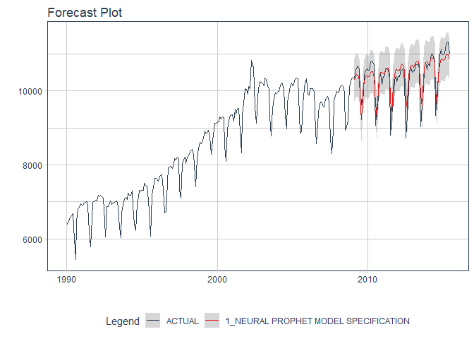

<!-- README.md is generated from README.Rmd. Please edit that file -->

# neuralprophet

<!-- badges: start -->

[](https://cran.r-project.org/package=neuralprophet)


[](https://github.com/AlbertoAlmuinha/neuralprophet/actions)
<!-- badges: end -->

> The NEW Neural Prophet arrives to R!

    # Install Development Version 
    remotes::install_github("AlbertoAlmuinha/neuralprophet")

Not on CRAN yet:

``` r
#install.packages("neuralprophet")
```

## Neural Prophet Algorithm

Using `neural_prophet()`, which connects to `Python NeuralProphet()`.

``` r
library(neuralprophet)
library(tidymodels)
library(tidyverse)
library(timetk)

m <- m4_monthly %>% filter(id == "M750")

splits <- initial_time_split(m)


model_fit_nprophet <- neural_prophet(
    freq            = "M",
    growth          = "linear",
    trend_reg       = 3,
    learn_rate      = 0.1,
    changepoint_range = 0.8,
    seasonality_mode = "additive"
) %>%
    set_engine("prophet") %>%
    fit(value ~ ., training(splits))

# Forecast with 95% Confidence Interval
modeltime_table(
    model_fit_nprophet
) %>%
    modeltime_calibrate(new_data = testing(splits)) %>%
    modeltime_forecast(
        new_data      = testing(splits),
        actual_data   = m,
        conf_interval = 0.95
    ) %>%
    plot_modeltime_forecast(.interactive = FALSE)
```



## Installation

There are 2 key components to installing neuralprophet:

1.  Download the R-Package, `neuralprophet`. This installs the
    R-Bindings, which allows you to interface with NeuralProphet

2.  Set up the Python Environment so `neuralprophet` can connect to the
    `neuralprophet` python package.

### Step 1 - Download & Install neuralprophet

Download the latest development version.

``` r
remotes::install_github("AlbertoAlmuinha/neuralprophet")
```

### Step 2 - Python Environment Setup

Next, you’ll need to set up a Python Environment that contains at a
minimum:

-   `neuralprophet==0.2.7`
-   `pillow==8.3.0`
-   `pandas==1.2.5`
-   `numpy==1.21.0`
-   `torch==1.9.0`

The python environment then needs to be activated with `reticulate`.

**Fast Setup**

You can use `install_nprophet()` to prepare and bind to a python
environment containing `neuralprophet` and the required python packages.

-   You only need to run this one time, and then you are good to go.
-   Each time you load `neuralprophet`, the package will include this
    environment in it’s search process.

``` r
# Neural Prophet Installation - Run 1st time
install_nprophet()
```

### Step 3 - Restart R and Try an Example

Restart your R session (if in RStudio, close and re-open). Then try this
example.

``` r
library(neuralprophet)
library(tidymodels)
library(tidyverse)
library(timetk)

m <- m4_monthly %>% filter(id == "M750")

splits <- initial_time_split(m)


model_fit_nprophet <- neural_prophet(
    freq            = "M",
    growth          = "linear",
    trend_reg       = 3,
    learn_rate      = 0.1,
    changepoint_range = 0.8,
    seasonality_mode = "additive"
) %>%
    set_engine("prophet") %>%
    fit(value ~ ., training(splits))

# Forecast with 95% Confidence Interval
modeltime_table(
    model_fit_nprophet
) %>%
    modeltime_calibrate(new_data = testing(splits)) %>%
    modeltime_forecast(
        new_data      = testing(splits),
        actual_data   = m,
        conf_interval = 0.95
    ) %>%
    plot_modeltime_forecast(.interactive = FALSE)
```

## Troubleshooting Installation

Python Environment setup is always fun. Here are a few recommendations
if you run into an issue.

-   **Check to make sure Conda or Miniconda is available** using
    `reticulate::conda_version()`. If no conda version is returned, then
    use `reticulate::install_miniconda()` to install Miniconda
    (recommended vs full Aniconda). Then (re-)run `install_gluonts()`.

-   **Check if Neural Prophet (Python) is available** using
    `reticulate::py_module_available("neuralprophet")`. If this returns
    `TRUE`, then your installation has succeeded in building the
    environment, but you may have other issues like missing C++ build
    tools (next).

-   **Windows 10 error: Microsoft Visual C++ is required.** [Here are
    the instructions for installing the C++ tools
    needed.](https://github.com/business-science/modeltime.gluonts/issues/4)

-   **Other installation issues.** [Please file a GitHub issue
    here.](https://github.com/AlbertoAlmuinha/neuralprophet/issues)
